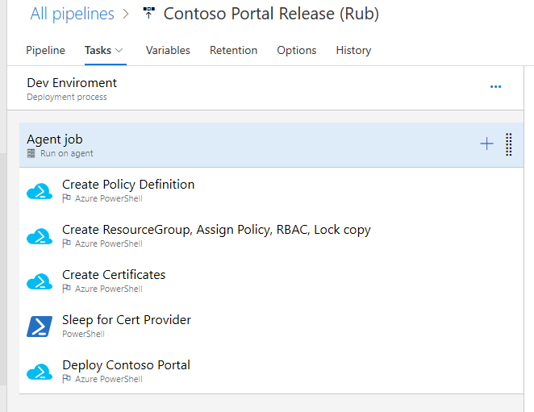

# CI/CD Crawl Walk Run

This sample provides the templates for configuring a subscription with policy and RBAC (on a resource group) to deploy the "Contoso Portal" into dev, test and prod environments.  The code was part of a walkthrough delivered at the MVP Summit in March 2019.

## Build Pipelines

The demo shows a maturation or progression of using templates in a CI/CD pipeline.  The YAML defintions are included here, you will need to edit them to adjust for the paths of the files in your repo and things like the subscription for deployment.  Note that the build pipelines do not perform subscription setup, that's only done in the release pipeline.

### Crawl

This shows a pipeline that uses the AzDO tasks to stage artifacts and deploy templates.  This approach is commonly used when learning about pipelines due to the simplicity of setup.  There are 2 tasks, one for staging and the other for template deployment.  

### Walk

This pipeline deploys that same template as the Crawl pipeline but uses the script in the repo.  This has the advantage of using the same code developers use on the "dev box" so there is little chance for drift between what developers do and what the pipeline does.  The script will stage and deploy so only one task is needed.

### Run

This pipeline only publishes the artifacts for the release pipeline, it does not deploy the template.  In practice, you would use this pipeline to run tests and of course, one of those tests could be deploying the template but for simplicity I chose not to.

## Release Pipeline (Rub)

When you're really ready to ["rub some devops on it"&trade;](https://github.com/DarqueWarrior) you can use the release pipeline to deploy the entire environment.  YAML output of release pipelines isn't supported (as I type this) so there is a screenshot showing the stages of the release pipeline.

This pipeline does the following:

1) Runs Deploy-AzTemplate.ps1 to create the [policy definition](/SubscriptionSetup/policy.definition.json)
2) Creates a [resource group](./SubscriptionSetup/create.resourcegroup.json) assigns the policy, sets RBAC in the group for the provided principal and locks the resource group so it cannot be deleted.
3) Runs a script to [create a cert](.ContosoPortal/scripts/Create-Cert.ps1) you could also think of things like [creating a service principal](.ContosoPortal/scripts/Create-SP.ps1)
4) Sleeps for a few seconds while ActiveDirectory propogates the whatever you did in step 3 (though not really needed with a cert).  This is just an inline script that does "Start-Sleep"
5) Deploys the [Contoso Portal](./ContosoPortal/azuredeploy.json).  This template deploys a "shim" workload just to show how it can be done.

### Stages

There are multiple stages in the pipeline, one for Dev, Test and Prod.  The different parameters files in the sample show an example of scaling across those, you can also envision using different KeyVaults for different environments or using pipeline variables for secrets.  I prefer to put as much into templates as possible and use pipelines for orchestration but either approach will work fine.
